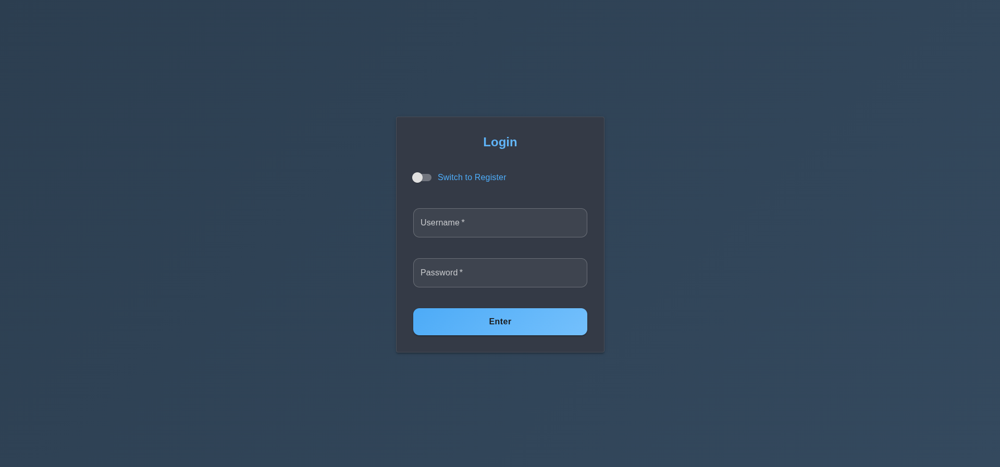

# AI Agents System - Repository

Professional portfolio project: FastAPI backend + React frontend (Material UI), JWT authentication, WebSocket, Docker Compose.

## 🚀 Technologies

- **Backend:** FastAPI (REST API, WebSocket), Python 3.10+
- **Frontend:** React 18 + Material UI (MUI)
- **Authentication:** JWT, OAuth2 (base), SSO (extensible)
- **Communication:** REST, WebSocket
- **Containerization:** Docker, Docker Compose
- **Database:** PostgreSQL
- **AI Integration:** Ollama, OpenAI, Anthropic, DeepSeek
- **Monitoring:** Prometheus, Grafana (optional)

## 🚀 Optional Enhancements

### Redis Distributed Caching
- **Purpose**: Improve performance and scalability for data analysis
- **Status**: Optional - falls back to in-memory cache if not available
- **Configuration**: Set `REDIS_HOST` and `REDIS_PORT` in `.env`

### Sentry Error Monitoring
- **Purpose**: Advanced error tracking and monitoring in production
- **Status**: Optional - only activates if `SENTRY_DSN` is configured
- **Configuration**: Set `SENTRY_DSN` in `.env` for production

### React Context for State Management
- **Purpose**: Better state management for scalable frontend development
- **Status**: Active - replaces local state with global context
- **Configuration**: No configuration needed

### Architecture Documentation
- **Purpose**: Visual representation of system architecture
- **Status**: Active - Mermaid diagram in README.md
- **Configuration**: No configuration needed

---

### Configuration Guide (Redis & Sentry)

#### Redis Caching (Optional)
1. **Install Redis** (if not already installed):
   ```bash
   # Ubuntu/Debian
   sudo apt-get install redis-server
   # macOS
   brew install redis
   # Windows: https://redis.io/download
   ```
2. **Configure environment variables** in `.env`:
   ```env
   REDIS_HOST=localhost
   REDIS_PORT=6379
   REDIS_URL=redis://localhost:6379
   ```
3. **Start Redis server**:
   ```bash
   redis-server
   ```
4. **Verify Redis connection**:
   ```bash
   redis-cli ping
   # Should return: PONG
   ```

#### Sentry Error Monitoring (Optional)
1. **Create a Sentry account** at [sentry.io](https://sentry.io)
2. **Create a new project** and get your DSN
3. **Configure environment variables** in `.env`:
   ```env
   SENTRY_DSN=https://your-sentry-dsn@sentry.io/project-id
   ```
4. **Sentry will automatically activate** when:
   - `SENTRY_DSN` is set
   - `DEBUG=false` (production mode)

---

### Verification & Backward Compatibility
- All new features are **optional** and backward compatible.
- If Redis or Sentry are not configured, the system works as before.
- Use the verification script to check your setup:
  ```bash
  cd repository/backend
  python ../scripts/verify_setup.py
  ```
- The script checks imports, configuration, structure, dependencies, and basic functionality.

---

## 📁 Project Structure

```
repository/
├── backend/                 # FastAPI Backend
│   ├── app/
│   │   ├── api/v1/         # API Endpoints
│   │   ├── core/           # Configuration and dependencies
│   │   ├── models/         # Database models
│   │   ├── schemas/        # Pydantic schemas
│   │   ├── services/       # Business logic
│   │   └── main.py         # Entry point
│   ├── Dockerfile          # Backend Docker image
│   ├── requirements.txt    # Python dependencies
│   └── README.md           # Backend documentation
├── frontend/               # React Frontend
│   ├── src/
│   │   ├── components/     # React components
│   │   ├── api/           # API client and WebSocket
│   │   ├── App.jsx        # Main component
│   │   └── main.jsx       # Entry point
│   ├── Dockerfile         # Frontend Docker image
│   ├── package.json       # Node.js dependencies
│   └── README.md          # Frontend documentation
├── scripts/               # Utility scripts
│   ├── check_gitignore.py # .gitignore verification
│   └── setup_railway.py   # Railway configuration
├── .github/workflows/     # CI/CD
│   └── ci-cd.yml         # Integration pipeline
├── docker-compose.yml     # Service orchestration
├── railway.json          # Railway configuration
├── requirements.txt      # Python dependencies (root)
└── README.md            # This file
```

## 📋 Prerequisites

Before starting, ensure you have the following installed:

- **Docker and Docker Compose** (for containerized deployment)
- **Node.js 18+** (for local frontend development)
- **Python 3.10+** (for local backend development)
- **PostgreSQL** (for local database development)
- **Git** (for cloning the repository)

### System Requirements
- **RAM:** Minimum 4GB, Recommended 8GB+
- **Storage:** Minimum 2GB free space
- **Network:** Internet connection for downloading dependencies

## 🛠️ Installation and Usage

### Option 1: Docker Compose (Recommended)

1. **Clone the repository:**
   ```bash
   git clone <repository-url>
   cd <repository-name>
   ```

2. **Configure environment (optional):**
   ```bash
   # For custom development setup
   cp docker-compose.override.example.yml docker-compose.override.yml
   # Edit docker-compose.override.yml as needed
   ```

3. **Start the services:**
   ```bash
   docker-compose up --build
   ```

3. **Access the application:**
   - **Frontend:** [http://localhost:5173](http://localhost:5173)
   - **Backend (docs):** [http://localhost:8000/docs](http://localhost:8000/docs)

### Option 2: Local Development

#### Backend
```bash
cd backend
python -m venv venv
source venv/bin/activate  # Linux/Mac
# or venv\Scripts\activate  # Windows
pip install -r requirements.txt
cp .env.example .env
# Edit .env with your configurations
uvicorn app.main:app --reload --host 0.0.0.0 --port 8000
```

#### Frontend
```bash
cd frontend
npm install
cp .env.example .env
# Edit .env with backend URL
npm run dev
```

## 🔧 Configuration

### Environment Variables

#### Backend (.env)
```env
# Basic configuration
APP_NAME=AI Agents System
DEBUG=false

# Database
DATABASE_URL=sqlite:///./agent_ia.db

# Security
SECRET_KEY=your_very_secure_secret_key_here
ALGORITHM=HS256
ACCESS_TOKEN_EXPIRE_MINUTES=30

# CORS
ALLOWED_ORIGINS=["http://localhost:3000", "http://localhost:5173"]

# LLM
OPENAI_API_KEY=your_openai_api_key
ANTHROPIC_API_KEY=your_anthropic_api_key
DEFAULT_LLM_PROVIDER=openai

# Redis
REDIS_URL=redis://localhost:6379
```

#### Frontend (.env)
```env
# Backend URL
VITE_API_URL=http://localhost:8000
VITE_WS_URL=ws://localhost:8000

# Application configuration
VITE_APP_NAME=AI Agents System
VITE_APP_VERSION=1.0.0

# Development configuration
VITE_DEBUG=true
```

## 📡 API Endpoints

### Authentication
- `POST /api/v1/auth/login` - Login
- `POST /api/v1/auth/register` - Register
- `GET /api/v1/auth/me` - Get current user information
- `POST /api/v1/auth/refresh` - Refresh token

### Chat
- `POST /api/v1/chat/message` - Send chat message
- `GET /api/v1/chat/conversations` - Get user conversations
- `GET /api/v1/chat/conversations/{id}/history` - Get conversation history
- `DELETE /api/v1/chat/conversations/{id}` - Delete conversation

### Data Analysis
- `POST /api/v1/data/analyze` - Perform data analysis
- `POST /api/v1/data/upload` - Upload data file
- `GET /api/v1/data/sources` - Get data sources
- `GET /api/v1/data/analyses` - Get analysis history

### WebSockets
- `WS /ws/chat` - Real-time chat channel
- `WS /ws/data` - Real-time data analysis channel
- `WS /ws/notifications` - Notifications channel

### AI Integration (DeepSeek/Ollama)
- `GET /api/v1/ai/health` - Check AI service health
- `GET /api/v1/ai/models` - List available models
- `POST /api/v1/ai/generate` - Generate text/code response
- `POST /api/v1/ai/chat` - Chat with AI model
- `POST /api/v1/ai/pull-model` - Download new model

## 🤖 AI API Usage Examples

### Authentication
First, you need to authenticate to access AI endpoints:

```bash
# Login to get access token
curl -X POST "http://localhost:8000/api/v1/auth/login" \
  -H "Content-Type: application/json" \
  -d '{
    "username": "your_username",
    "password": "your_password"
  }'

# Response:
{
  "access_token": "eyJ0eXAiOiJKV1QiLCJhbGciOiJIUzI1NiJ9...",
  "token_type": "bearer"
}
```

### Check AI Service Health
```bash
curl -X GET "http://localhost:8000/api/v1/ai/health" \
  -H "Authorization: Bearer YOUR_ACCESS_TOKEN"

# Response:
{
  "status": "healthy",
  "models": ["deepseek-coder:6.7b"],
  "base_url": "http://172.17.0.1:11434"
}
```

### List Available Models
```bash
curl -X GET "http://localhost:8000/api/v1/ai/models" \
  -H "Authorization: Bearer YOUR_ACCESS_TOKEN"

# Response:
{
  "success": true,
  "models": [
    {
      "name": "deepseek-coder:6.7b",
      "size": 4089440256,
      "modified_at": "2024-01-15T10:30:00Z"
    }
  ]
}
```

### Generate Code/Text
```bash
curl -X POST "http://localhost:8000/api/v1/ai/generate" \
  -H "Authorization: Bearer YOUR_ACCESS_TOKEN" \
  -H "Content-Type: application/json" \
  -d '{
    "prompt": "Write a Python function to calculate fibonacci numbers",
    "model": "deepseek-coder:6.7b"
  }'

# Response:
{
  "success": true,
  "response": "def fibonacci(n):\n    if n <= 1:\n        return n\n    return fibonacci(n-1) + fibonacci(n-2)\n\n# Example usage\nprint(fibonacci(10))  # Output: 55",
  "model": "deepseek-coder:6.7b",
  "prompt_length": 58
}
```

### Chat with AI
```bash
curl -X POST "http://localhost:8000/api/v1/ai/chat" \
  -H "Authorization: Bearer YOUR_ACCESS_TOKEN" \
  -H "Content-Type: application/json" \
  -d '{
    "prompt": "Explain what is machine learning in simple terms",
    "model": "deepseek-coder:6.7b"
  }'

# Response:
{
  "user": "your_username",
  "prompt": "Explain what is machine learning in simple terms",
  "response": "Machine learning is like teaching a computer to learn from examples...",
  "model": "deepseek-coder:6.7b"
}
```

### Download New Model
```bash
curl -X POST "http://localhost:8000/api/v1/ai/pull-model" \
  -H "Authorization: Bearer YOUR_ACCESS_TOKEN" \
  -H "Content-Type: application/json" \
  -d '{
    "model_name": "llama2:7b"
  }'

# Response:
{
  "success": true,
  "message": "Model llama2:7b pulled successfully",
  "model": "llama2:7b"
}
```

### JavaScript/React Example
```javascript
// Using fetch API
const generateCode = async (prompt, model = 'deepseek-coder:6.7b') => {
  try {
    const response = await fetch('http://localhost:8000/api/v1/ai/generate', {
      method: 'POST',
      headers: {
        'Authorization': `Bearer ${accessToken}`,
        'Content-Type': 'application/json',
      },
      body: JSON.stringify({ prompt, model })
    });
    
    const data = await response.json();
    return data;
  } catch (error) {
    console.error('Error generating code:', error);
    throw error;
  }
};

// Usage
const result = await generateCode('Create a React component for a todo list');
console.log(result.response);
```

### Python Example
```python
import requests

def generate_ai_response(prompt, model="deepseek-coder:6.7b", token="YOUR_ACCESS_TOKEN"):
    url = "http://localhost:8000/api/v1/ai/generate"
    headers = {
        "Authorization": f"Bearer {token}",
        "Content-Type": "application/json"
    }
    data = {
        "prompt": prompt,
        "model": model
    }
    
    response = requests.post(url, json=data, headers=headers)
    return response.json()

# Usage
result = generate_ai_response("Write a function to sort a list")
print(result["response"])
```

### Advanced Usage Examples

#### Code Review and Refactoring
```bash
curl -X POST "http://localhost:8000/api/v1/ai/generate" \
  -H "Authorization: Bearer YOUR_ACCESS_TOKEN" \
  -H "Content-Type: application/json" \
  -d '{
    "prompt": "Review and refactor this Python code:\n\ndef calculate_sum(numbers):\n    total = 0\n    for i in range(len(numbers)):\n        total = total + numbers[i]\n    return total",
    "model": "deepseek-coder:6.7b"
  }'
```

#### API Documentation Generation
```bash
curl -X POST "http://localhost:8000/api/v1/ai/generate" \
  -H "Authorization: Bearer YOUR_ACCESS_TOKEN" \
  -H "Content-Type: application/json" \
  -d '{
    "prompt": "Generate OpenAPI documentation for a user management API with endpoints for CRUD operations",
    "model": "deepseek-coder:6.7b"
  }'
```

#### Database Query Optimization
```bash
curl -X POST "http://localhost:8000/api/v1/ai/generate" \
  -H "Authorization: Bearer YOUR_ACCESS_TOKEN" \
  -H "Content-Type: application/json" \
  -d '{
    "prompt": "Optimize this SQL query and explain the improvements:\nSELECT * FROM users u JOIN orders o ON u.id = o.user_id WHERE u.created_at > '2024-01-01'",
    "model": "deepseek-coder:6.7b"
  }'
```

#### Docker Configuration
```bash
curl -X POST "http://localhost:8000/api/v1/ai/generate" \
  -H "Authorization: Bearer YOUR_ACCESS_TOKEN" \
  -H "Content-Type: application/json" \
  -d '{
    "prompt": "Create a multi-stage Dockerfile for a Python FastAPI application with Redis and PostgreSQL dependencies",
    "model": "deepseek-coder:6.7b"
  }'
```

### Error Handling Examples

#### Handling API Errors
```javascript
const generateWithErrorHandling = async (prompt, model = 'deepseek-coder:6.7b') => {
  try {
    const response = await fetch('http://localhost:8000/api/v1/ai/generate', {
      method: 'POST',
      headers: {
        'Authorization': `Bearer ${accessToken}`,
        'Content-Type': 'application/json',
      },
      body: JSON.stringify({ prompt, model })
    });
    
    if (!response.ok) {
      const errorData = await response.json();
      throw new Error(`API Error: ${errorData.detail || response.statusText}`);
    }
    
    const data = await response.json();
    return data;
  } catch (error) {
    console.error('Error:', error.message);
    return { success: false, error: error.message };
  }
};
```

#### Retry Logic
```python
import requests
import time
from typing import Optional

def generate_with_retry(prompt: str, model: str = "deepseek-coder:6.7b", 
                       token: str = "YOUR_ACCESS_TOKEN", max_retries: int = 3) -> Optional[dict]:
    """Generate AI response with retry logic"""
    for attempt in range(max_retries):
        try:
            url = "http://localhost:8000/api/v1/ai/generate"
            headers = {
                "Authorization": f"Bearer {token}",
                "Content-Type": "application/json"
            }
            data = {"prompt": prompt, "model": model}
            
            response = requests.post(url, json=data, headers=headers, timeout=30)
            response.raise_for_status()
            return response.json()
            
        except requests.exceptions.RequestException as e:
            print(f"Attempt {attempt + 1} failed: {e}")
            if attempt < max_retries - 1:
                time.sleep(2 ** attempt)  # Exponential backoff
            else:
                print("All retry attempts failed")
                return None
```

### Integration Examples

#### React Hook for AI Chat
```javascript
import { useState, useEffect } from 'react';

const useAIChat = (accessToken) => {
  const [messages, setMessages] = useState([]);
  const [isLoading, setIsLoading] = useState(false);
  const [error, setError] = useState(null);

  const sendMessage = async (prompt, model = 'deepseek-coder:6.7b') => {
    setIsLoading(true);
    setError(null);
    
    try {
      const response = await fetch('http://localhost:8000/api/v1/ai/chat', {
        method: 'POST',
        headers: {
          'Authorization': `Bearer ${accessToken}`,
          'Content-Type': 'application/json',
        },
        body: JSON.stringify({ prompt, model })
      });
      
      const data = await response.json();
      
      if (data.success !== false) {
        setMessages(prev => [...prev, 
          { type: 'user', content: prompt },
          { type: 'ai', content: data.response, model: data.model }
        ]);
      } else {
        setError(data.error || 'Failed to get response');
      }
    } catch (err) {
      setError(err.message);
    } finally {
      setIsLoading(false);
    }
  };

  return { messages, sendMessage, isLoading, error };
};
```

#### FastAPI Integration Example
```python
from fastapi import FastAPI, Depends, HTTPException
from app.services.ai_service import ai_service
from app.services.auth_service import get_current_user

app = FastAPI()

@app.post("/api/v1/code-review")
async def review_code(
    code: str,
    current_user = Depends(get_current_user)
):
    """Review code using AI"""
    prompt = f"Review this code and provide suggestions for improvement:\n\n{code}"
    
    result = await ai_service.generate_response(
        prompt=prompt,
        model="deepseek-coder:6.7b"
    )
    
    if not result["success"]:
        raise HTTPException(status_code=500, detail=result["error"])
    
    return {
        "code_review": result["response"],
        "model": result["model"],
        "reviewer": current_user.username
    }
```

## 🚀 Deployment

### Railway (Recommended)
See [RAILWAY_DEPLOYMENT.md](RAILWAY_DEPLOYMENT.md) for detailed instructions.

### Other Services
- **Render:** Adapt Dockerfiles for production
- **Vercel:** Static frontend
- **Heroku:** Backend with Procfile
- **AWS/Azure:** Cloud containers

## 📚 Documentation

- [Development Guide](DEVELOPMENT.md) - Complete development setup and guidelines
- [Deployment Guide](DEPLOYMENT_GUIDE.md) - Complete deployment instructions
- [Secrets Management](SECRETS_MANAGEMENT.md) - Security best practices
- [AI API Examples](AI_API_EXAMPLES.md) - Practical usage examples and code samples
- [Contributing Guide](CONTRIBUTING.md) - How to contribute to the project
- [Changelog](CHANGELOG.md) - Version history and changes
- [Backend README](backend/README.md) - Backend-specific documentation
- [Frontend README](frontend/README.md) - Frontend-specific documentation

## 🧪 Testing

### Backend
```bash
cd backend
pytest
```

### Frontend
```bash
cd frontend
npm test
```

## 🔍 Monitoring

- **Health Check:** `GET /health`
- **Metrics:** `GET /metrics` (Prometheus)
- **Documentation:** `GET /docs` (Swagger UI)

## 🚨 Troubleshooting

### Common Issues and Solutions

#### Database Connection Errors
```bash
# Error: "connection to server failed"
# Solution: Ensure PostgreSQL is running
sudo systemctl status postgresql
sudo systemctl start postgresql

# Error: "role does not exist"
# Solution: Create database user
sudo -u postgres createuser --interactive
```

#### Port Conflicts
```bash
# Error: "Address already in use"
# Solution: Check and kill processes using the port
sudo lsof -i :8000
sudo kill -9 <PID>

# Alternative: Use different ports
docker-compose up -p 8001:8000
```

#### Environment Variable Issues
```bash
# Error: "DATABASE_URL not found"
# Solution: Copy and configure environment files
cp backend/.env.example backend/.env
cp frontend/.env.example frontend/.env
# Edit .env files with your configuration
```

#### Docker Issues
```bash
# Error: "Cannot connect to the Docker daemon"
# Solution: Start Docker service
sudo systemctl start docker
sudo usermod -aG docker $USER  # Add user to docker group

# Error: "No space left on device"
# Solution: Clean up Docker
docker system prune -a
```

#### AI Service Issues
```bash
# Error: "Ollama connection failed"
# Solution: Install and start Ollama
curl -fsSL https://ollama.ai/install.sh | sh
ollama serve

# Error: "Model not found"
# Solution: Pull required models
ollama pull deepseek-coder:6.7b
```

### Getting Help
- Check the logs: `docker-compose logs <service-name>`
- Verify setup: `python scripts/verify_setup.py`
- Review documentation: [Deployment Guide](DEPLOYMENT_GUIDE.md)
- Open an issue on GitHub with detailed error information

## 🤝 Contributing

1. Fork the project
2. Create a feature branch (`git checkout -b feature/AmazingFeature`)
3. Commit your changes (`git commit -m 'Add some AmazingFeature'`)
4. Push to the branch (`git push origin feature/AmazingFeature`)
5. Open a Pull Request

## 📄 License

This project is licensed under the MIT License. See the `LICENSE` file for details.

## 👨‍💻 Author

Developed by **Neo Gerardo** ([GitHub Profile](https://github.com/Gerardo-Cabrera))

<!--
### Contact Information
- **Email**: [your-email@example.com]
- **LinkedIn**: [Your LinkedIn Profile]
- **Portfolio**: [Your Portfolio Website]

### Acknowledgments
- FastAPI community for the excellent framework
- React and Material-UI teams for the frontend tools
- Ollama team for local AI model support
- All contributors and users of this project
-->
---

## 📐 Architecture


## 🎯 Main Features

- **Advanced Chatbot**: Text processing with contextual memory
- **Virtual Assistant**: Audio (STT/TTS) and text support
- **Autonomous Agent**: Makes decisions and executes actions automatically
- **Data Analyst**: Data analysis and visualization
- **Long-term Memory**: Vector storage with ChromaDB
- **Asynchronous Tasks**: Background processing with Celery
- **REST API**: Complete FastAPI interface
- **Web Interface**: Modern UI with Material-UI
- **Optimized System**: 
  - Efficient memory management with automatic limits
  - Intelligent LLM cache with configurable TTL
  - Automatic fallback system between providers
  - Enhanced validation and security
  - Automatic temporary file cleanup
  - Real-time monitoring and metrics

## 📸 Screenshots

### Login Interface

*Modern login interface with Material-UI design*

### Chat Interface

*Real-time chat with AI models and WebSocket support*

<!--
### Data Analysis

*Data analysis interface with visualization capabilities*
-->

### Dashboard

*Main dashboard with system overview and metrics*

### API Documentation

*Interactive API documentation with Swagger UI*

> **Note**: Screenshots will be added to the `docs/screenshots/` directory. These are placeholder references for the actual screenshots. 