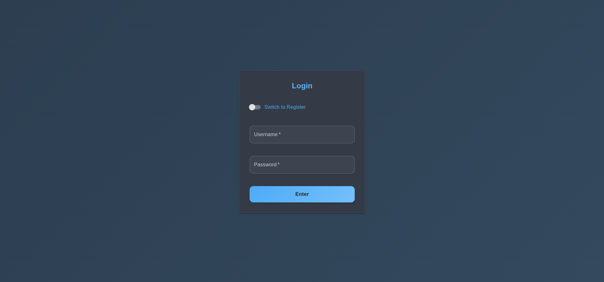
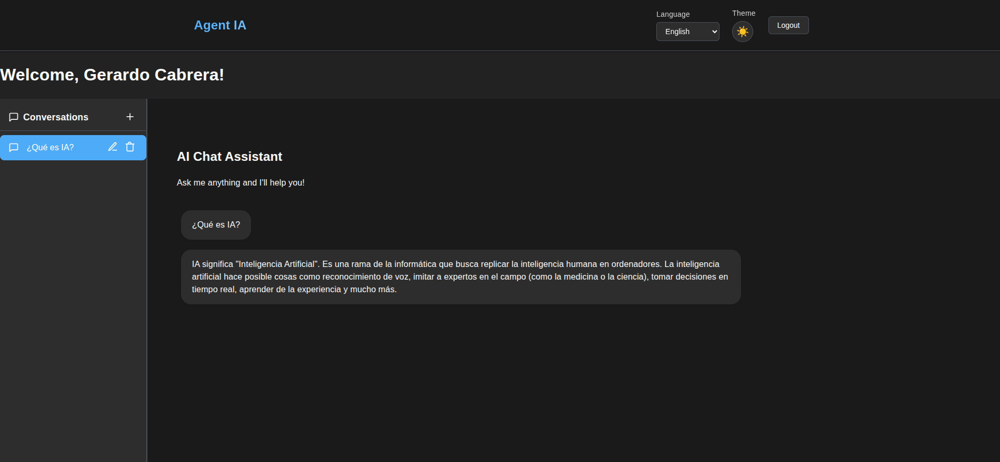

# Screenshots Directory

This directory contains screenshots of the AI Agents System interface for documentation purposes.

## 📸 Required Screenshots

### Core Interface Screenshots
- `login.png` - Login interface with Material-UI design
- `chat.png` - Real-time chat interface with AI models
- `data-analysis.png` - Data analysis interface with visualizations
- `dashboard.png` - Main dashboard with system overview
- `api-docs.png` - Interactive API documentation (Swagger UI)

### Additional Screenshots (Optional)
- `registration.png` - User registration interface
- `settings.png` - User settings and preferences
- `notifications.png` - Notification system interface
- `mobile-view.png` - Mobile responsive design
- `dark-theme.png` - Dark theme interface

## 📋 Screenshot Guidelines

### Technical Requirements
- **Format**: PNG or JPG
- **Resolution**: Minimum 1920x1080 (Full HD)
- **File Size**: Maximum 2MB per screenshot
- **Quality**: High quality, clear and readable

### Content Guidelines
- Use the latest version of the application
- Show representative data (not sensitive information)
- Include error states and loading states
- Capture both light and dark themes
- Show responsive design on different screen sizes

### Naming Convention
- Use descriptive, lowercase names
- Separate words with hyphens
- Include the feature name: `feature-name.png`
- Add suffix for variations: `feature-name-mobile.png`

## 🎨 Screenshot Capture Instructions

### Desktop Screenshots
1. Open the application in a modern browser
2. Set browser window to 1920x1080 resolution
3. Navigate to the specific feature
4. Take screenshot using browser dev tools or system screenshot tool
5. Crop to remove browser chrome if necessary
6. Save with appropriate filename

### Mobile Screenshots
1. Use browser dev tools mobile emulation
2. Set to common mobile resolution (e.g., 375x667 for iPhone)
3. Capture portrait and landscape orientations
4. Show touch interactions and responsive behavior

### API Documentation Screenshots
1. Navigate to `/docs` endpoint
2. Show the Swagger UI interface
3. Include example of expanded endpoint
4. Show authentication section

## 🔄 Updating Screenshots

When updating screenshots:
1. Update this README with new requirements
2. Replace old screenshots with new ones
3. Update the main README.md references
4. Test that all links work correctly
5. Commit changes with descriptive message

## 📝 Example Screenshot Descriptions

```markdown
### Login Interface

*Modern login interface with Material-UI design, showing username/password fields and login button*

### Chat Interface

*Real-time chat interface with message history, input field, and AI response indicators*

### Data Analysis

*Data analysis interface with file upload, query input, and visualization results*
```

## 🚫 What NOT to Include

- Personal or sensitive information
- Real API keys or credentials
- Internal system paths or configurations
- Debug information or error logs
- Temporary or test data

## 📞 Support

If you need help creating or updating screenshots:
1. Check the main README.md for current interface descriptions
2. Review the CONTRIBUTING.md for development guidelines
3. Open an issue for specific screenshot requests
4. Contact the maintainers for guidance 